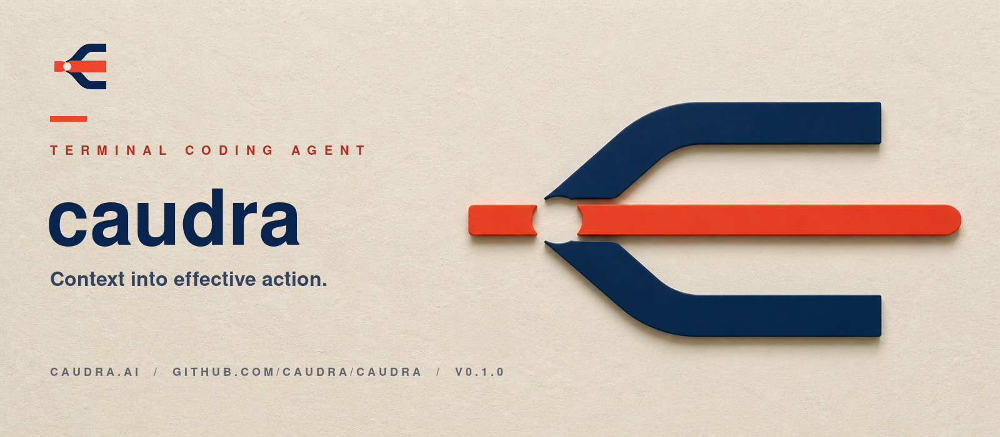

<p align="center">
  
</p>

# Caudra

Caudra turns context into effective action. It is a terminal coding agent that coordinates models, tools, plugins, and subagents while keeping execution visible and under your control.

Caudra is an independent fork maintained at [github.com/caudra/caudra](https://github.com/caudra/caudra). The current release line starts at `0.1.0` and uses a hard-break product identity.

Brought to you by [Thorsten Born](https://github.com/tensorninja) ([website](https://thorstenborn.com)).

## Project lineage

Caudra is derived from [Maki](https://github.com/tontinton/maki), originally developed by [Tony Solomonik](https://github.com/tontinton), and includes work by Maki contributors. Maki is licensed under the MIT License, and its contributor history is preserved in this repository.

Caudra modifications are maintained by [Thorsten Born](https://thorstenborn.com). Caudra is not affiliated with or endorsed by the original project.

## Why Caudra

### Effective action

- `index` parses supported languages with [tree-sitter](https://tree-sitter.github.io/tree-sitter) and returns compact file structure with exact line ranges.
- `python_execution` uses [Monty](https://github.com/pydantic/monty) to run bounded, isolated Python over values already in context. It cannot call tools or access host files, processes, or the network. The final expression and printed output return as one tool result.
- `task` delegates isolated planning or implementation to subagents with selectable models and thinking modes.
- Tool results feed back into the next decision, so Caudra can inspect failures, change course, and continue.

### Control and visibility

- Native Rust TUI with fast startup, 60 FPS rendering, and low memory use.
- Tree-sitter shell parsing that reviews each command in a compound expression instead of approving by prefix.
- Full task transcripts, live steering, session rewind, plan mode, and explicit permission scopes.
- Headless and SDK modes, ACP support for editors, MCP servers, skills, persistent memory, and image input.
- Opt-in [OpenTelemetry](https://caudra.ai/docs/telemetry/) export using `caudra.*` metrics and events.

### Extensible by design

Caudra has a Neovim-style Lua API. Built-in and user plugins can add tools, commands, keymaps, and UI. See the [built-in plugins](https://github.com/caudra/caudra/tree/main/plugins) and [Lua API reference](https://caudra.ai/docs/lua-api/).

## Providers

Caudra supports Anthropic, OpenAI, xAI, Google, Copilot, Ollama, llama.cpp, Mistral, Z.AI, DeepSeek, OpenRouter, Synthetic, TensorX, OpenCode, Aperture, and compatible OpenAI or Anthropic endpoints.

Run `caudra auth login` for the interactive setup, or configure provider environment variables. Dynamic provider scripts live in `~/.config/caudra/providers/`. See the [provider reference](https://caudra.ai/docs/providers/).

## Install

### Linux and macOS

Review the installer before running it:

```sh
curl -fsSL https://caudra.ai/install.sh -o install.sh
cat install.sh
chmod +x install.sh && sh install.sh
```

Or run the one-liner:

```sh
curl -fsSL https://caudra.ai/install.sh | sh
```

The default install directory is `~/.local/bin`. Set `CAUDRA_INSTALL_DIR` to override it.

### Windows PowerShell

```powershell
irm https://caudra.ai/install.ps1 -OutFile install.ps1
Get-Content install.ps1
.\install.ps1
```

Or run:

```powershell
irm https://caudra.ai/install.ps1 | iex
```

The Windows installer uses `%LOCALAPPDATA%\caudra` and adds it to the user `PATH`. Set `CAUDRA_INSTALL_DIR` to override it.

### Other options

```sh
# Main branch
cargo install --locked --git https://github.com/caudra/caudra.git caudra

# Nix
nix run github:caudra/caudra
```

Prebuilt binaries are available from [GitHub Releases](https://github.com/caudra/caudra/releases/latest).

## Start

From a repository:

```sh
caudra
```

Run `caudra acp` to expose Caudra to an ACP client such as Zed. Use `caudra --print` for scripts and CI.

## Documentation

- [Quick start](https://caudra.ai/docs/quick-start/)
- [Tools](https://caudra.ai/docs/tools/)
- [Configuration](https://caudra.ai/docs/configuration/)
- [Permissions](https://caudra.ai/docs/permissions/)
- [Example config](https://github.com/caudra/config)

The example config includes a [Semble](https://github.com/MinishLab/semble) semantic code-search tool and an [ast-grep](https://ast-grep.github.io) MCP server.
