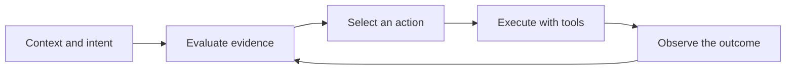

# Caudra Identity

Status: adopted

Release line: `0.1.0`

Canonical repository: [github.com/caudra/caudra](https://github.com/caudra/caudra)

Canonical site, documentation, and installer origin: [caudra.ai](https://caudra.ai)

Caudra is an independent fork. Its product identity, executable, package names,
configuration paths, website, and telemetry namespace all use Caudra without a
compatibility brand layer.

## Positioning

The core statement is:

> Caudra turns context into effective action.

Caudra is a terminal coding agent built to select and execute useful next steps.
It reads the situation, coordinates the available capabilities, acts through
tools, and adapts to the result. Token economy remains an implementation
advantage. Capability, control, decision quality, and execution lead the story.

### Message pillars

#### Effective action

The useful output is completed work: a diagnosis, edit, test result, or review.
Interface activity is supporting evidence rather than the product promise.

#### Coordinated capability

Caudra brings models, native tools, plugins, subagents, and client interfaces
into one agent loop. Each capability serves the current goal.

#### Adaptation from outcomes

Tool results change the next decision. Caudra can inspect a failed command,
revise its approach, and continue.

#### User control

Permissions, review, steering, and explicit configuration keep execution under
the user's control.

## Name origin

Caudra is a coined name inspired by *caudate*. The caudate nucleus participates
in brain circuits associated with goal-directed action, action-outcome learning,
and decisions that combine evidence with expected reward.

The product analogy is limited and deliberate:



Caudra is inspired by this role. It is not modeled on a brain structure. Product
copy must not imply consciousness, biological equivalence, or independent goals.

### Short origin story

> Caudra is named after the caudate nucleus, part of the brain circuits that
> connect evidence, goals, and action. The name reflects an agent designed to
> turn context into the right next step.

## Naming

Use `Caudra` for the project and product. Use `caudra` for the executable,
package identifiers, paths, API namespaces, and the lowercase wordmark.

```text
Caudra
caudra
caudra auth login
caudra acp
~/.config/caudra/
caudra.api
caudra.storage.write.count
```

The canonical pronunciation is **KAW-druh**, IPA `/ˈkɔːdrə/`.

Use the canonical endpoints consistently:

| Purpose | Endpoint |
| --- | --- |
| Source and releases | `github.com/caudra/caudra` |
| Example configuration | `github.com/caudra/config` |
| Product site | `https://caudra.ai` |
| Documentation | `https://caudra.ai/docs/` |
| Installer | `https://caudra.ai/install.sh` and `https://caudra.ai/install.ps1` |

Do not imply ownership of `caudra.com`. It is an unrelated third-party site.

## Voice

Caudra copy is direct, technical, and calm. State what the product does and why
it matters. Prefer concrete actions and outcomes over claims about intelligence.

Preferred vocabulary:

- action
- intent
- context
- capability
- execution
- evidence
- outcome
- adaptation
- coordination
- control

Keep cost, scarcity, and token counts as supporting evidence. Avoid medical
imagery, brain metaphors beyond the short origin story, and claims that the
agent always knows the right answer.

## Visual identity

The identity uses a lowercase `caudra` wordmark and a decision-aperture mark. A
midnight shell forms a C around one coral route that continues as action.

The visual system is technical and high contrast:

- midnight navy and warm mineral white form the base
- vermilion identifies the selected route or active state
- precise curves, hairline rules, and monospace labels reinforce the CLI
- diagrams expose routing, state, and sequence rather than decorating the page
- motion, when present, follows a route or state transition

Avoid literal brains, anatomical scans, neural networks, glowing orbs, mascots,
and animal or food imagery. The identity communicates decision and execution.

### Mark construction

The midnight shell forms an open `C`. A coral route enters through a small
negative-space aperture and exits through the opening. The mark must remain
legible in one color and at favicon size.

### Wordmark

The wordmark is always lowercase. Use a sturdy monospace face with open counters
and enough spacing to remain clear in terminal-scale UI. Do not title-case the
wordmark even when the product name is title-cased in prose.

## Repository identity

Repository-facing copy should state the independent fork once near the product
introduction. This gives contributors and downstream users an unambiguous source
of releases, issues, security fixes, and documentation.

The release identity is complete at `0.1.0`:

- source lives at `github.com/caudra/caudra`
- public documentation and installers use `https://caudra.ai`
- user examples use `caudra` commands and paths
- Lua APIs use `caudra.*`
- OpenTelemetry metrics and events use `caudra.*`
- visual assets use the routing mark and lowercase wordmark

## Collision boundary

An apparel business uses the exact name at `caudra.com`. The technical
monochrome system, developer context, and `.ai` domain reduce visual and category
confusion, but they do not create ownership of the unrelated domain. Legal and
trademark questions remain separate from this identity guide.

## Sources

- Doi et al., [The caudate nucleus contributes causally to decisions that balance reward and uncertain visual information](https://elifesciences.org/articles/56694), eLife, 2020.
- Grahn, Parkinson, and Owen, [The cognitive functions of the caudate nucleus](https://www.sciencedirect.com/science/article/abs/pii/S0301008208001019), Progress in Neurobiology, 2008.
- Lau and Glimcher, [Action and Outcome Encoding in the Primate Caudate Nucleus](https://www.jneurosci.org/content/27/52/14502), Journal of Neuroscience, 2007.
