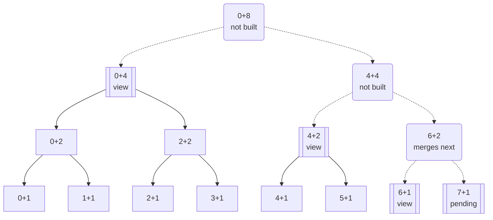

The agent saves what it learns about a project as notes, through the `memory` tool, and later sessions in the project start with those notes in view. Over time a project collects hundreds of them, more than a system prompt should carry. So the model reads a view of at most 32 KiB instead. Recent notes keep a line each in it, and older ones are folded into summary lines that cover more notes the older they are. When a line bears on its task, the model opens it to read what it summarizes.

## Notes and the journal

Each note is a Markdown file under the state directory, scoped per project:

`…/state/caudra/projects/<project-id>/memories/`

The state directory is `~/.local/state/caudra/` on Linux and macOS and `%APPDATA%\caudra\` on Windows. See [Directory layout](/docs/configuration/#directory-layout). In a [remote workspace](/docs/remote-workspaces/#client-owned-documents-and-state) the notes and their journal stay on your machine.

Caudra also keeps a journal of the notes in its global SQLite state database. Every write and every delete appends an entry, numbered from 0 in the order they happened, and no entry has to be pruned by hand. The files hold the current text of each note. The journal holds every version each note has had.

Edits made outside the tool, in an editor or the [workbench](/docs/workbench/#plans-memory-notes-and-prompt-drafts), are picked up at the next turn. A new or changed file appends a note entry, and a removed file appends a delete entry.

The first time Caudra opens a project's journal, it imports the existing notes, oldest first by modification time. The import keeps every note whole and leaves the files untouched.

Removing a project's `memories/` directory clears its journal at the next turn, so deleting the project's state directory still clears everything Caudra kept for the project.

## The summary tree

The Memory model builds a binary tree of one-line summaries over the journal, in the background. It first compresses each entry into a line of at most 512 bytes. Then it merges adjacent lines in pairs: two lines become one line covering both, two of those become one covering four, and so on up. An entry or a pair of lines short enough to fit in 512 bytes is kept word for word, with no model call.

Each line has an address, `id+n`, for the `n` entries from entry `id` on. `n` is always a power of two and `id` a multiple of it, so `368+8` covers entries 368 to 375 and was merged from `368+4` and `372+4`.

Eight entries, with a view of four lines and entry 7 not summarized yet:



Double borders mark the four lines in the view, and the label on `7+1` says its summary is still pending. Of the other lines, square corners mark those already written, and round corners with dotted edges mark those not written yet. `6+1` and `7+1` are the only pair of sibling lines in the view, so they are the next to merge, into `6+2`. That line can be written once entry 7 is summarized, and `4+4` and `0+8` can follow it.

## The view

The main session's system prompt carries the view: at most 32 KiB of lines, about 8k tokens, oldest first, inside `<memory>` tags. A line reads `id+n|text`, with the newlines of its text turned into spaces. An entry not summarized yet shows its name and first heading after `(not summarized yet)`. A shortened example, with invented notes:

```
<memory>
0+32|release-process: tag from main only after make ci passes. ci-cache: the key includes Cargo.lock. …
32+32|workbench-tabs: restored once per run and per checkout. …
...
544+2|sandbox-ttl: a lease of 0 never expires, so pause or delete the sandbox by hand. …
546+1|note scratch-dirs.md # Scratch dirs  Each project gets its own TMPDIR under the scratch root.
547+1|(not summarized yet) note flaky-tests.md: Flaky tests
</memory>
```

Each new entry appends a line of its own. While the lines add up to more than 32 KiB, the pair of sibling lines that ended longest ago merges into its parent line. Age counts in multiples of the pair's own size, so a pair of 16-entry lines goes first only once it ended 16 times as long ago as a pair of single entries. A pair merges only once its parent line is written, and a merged line is never split again.

While summaries are still being written, during the first import for example, the lines can add up to more than 32 KiB. The view then keeps only the newest lines that fit. Its first line says how many of the oldest entries are left out until their summaries are written, and that `memory search` finds them.

## Zoom and search

The [`memory` tool](/docs/tools/#memory) works on the journal and the note files:

| Command | Arguments | Does |
|---------|-----------|------|
| `view` | | Shows the live view, built from the journal as it is now |
| `zoom` | `id`, `n` | Opens line `id+n` into the two lines it was made from. With `n` = 1 it returns the entry whole, and whether that version is current, rewritten, deleted, or forgotten |
| `search` | `query` | Searches the current notes by word. A match in a note's name counts more than one in its body, and the newer note wins a tie. Returns the top 10 |
| `read` | `path` | Returns a note's current text |
| `write` | `path`, `content` | Writes a whole note and appends an entry |
| `delete` | `path` | Deletes a note and appends a delete entry |

`view`, `zoom`, `search`, and `read` need no approval, locally or in a remote workspace. `write` and `delete` go through the normal [permission checks](/docs/permissions/#plan-mode). A receipt from either names the number of the entry it appended.

In the transcript, a view or zoom card draws each line beside its address, in a column like a file's line numbers. A search card names each note with its heading and the line that matched, with the searched words marked. Click a hit to open the note in the [workbench](/docs/workbench/#plans-memory-notes-and-prompt-drafts).

`read` and `zoom` return the text the journal holds. A note imported from an earlier release comes without the YAML frontmatter that held its tags, while its file keeps it.

Rewriting a note under its existing name appends it again, which moves it to the detailed, recent end of the view. That is how a note is refreshed. Deleting is for notes that are wrong. Old notes need no pruning, because they fold into summaries, and a deleted note keeps its earlier versions in the journal, where `zoom` still reaches them.

Sessions saved by this version that hold the new kinds of `memory` result, such as a view or search hits, cannot be opened by older Caudra builds.

## When the view changes

The view in the system prompt is taken when the session starts, after a compaction, and when the working directory changes. In between it holds still. Writing a note never changes the system prompt mid-session, so the conversation the provider has cached stays valid.

Entries written elsewhere, by other sessions or by edits outside the tool, reach the model as a `# Memory updated` [reminder](/docs/context/#what-caudra-writes-on-your-behalf) instead. It lists one row per entry, with the address, the kind, the note's name, and its first heading:

```
- 548+1 note flaky-tests.md: Flaky tests
```

The model can zoom into a row with `n` = 1 to read the entry whole. After the next compaction the view includes those entries, and the reminder is withdrawn.

Subagents get the `memory` tool without the view.

## Summaries and spend

The summaries come from the Memory model job. Unbound, it uses the same model as compaction, the one running the session, because a summary line stands in for its notes for months. A stronger model costs several times more per line than a Fast one. To spend less, bind Memory to Fast or to an exact model in `/model`, as [Model jobs](/docs/providers/#model-jobs) describes. The model is chosen again each time you switch the Chat model or change a binding in `/model`, and the next line uses it, while a line being written finishes on the model it started with. Other Caudra processes that are already running see a binding change only after they restart. When a Memory binding cannot be resolved or its model cannot be loaded, summaries pause until the next switch or the next session.

Summaries are written while a TUI, SDK, or [ACP](/docs/acp/) session runs, two at a time. A one-shot `--print` run reads the view and writes notes, and leaves the summaries to the next long-running session.

In `/usage`, the session that runs the summaries counts their spend under the summarizing model, and the lifetime view lists it under `memory`, as does `caudra storage usage --group-by purpose`. See [Lifetime spend](/docs/token-economy/#lifetime-spend).

Several Caudra processes can work on one project at once. They share the summarizing through leases, so no line is written twice. A line whose model call fails for a passing reason, such as a rate limit, is tried again 10 seconds later.

Summarizing is on by default. To stop it:

```toml
[agent]
summarize_memory = false
```

New notes then show in the view by their name and first heading, as not summarized yet, and `memory search` still finds them. Once their lines pass 32 KiB, the view keeps the newest lines that fit, as [The view](#the-view) describes.

## The inspector

`/memory` opens an inspector of the mechanism as it runs.

The header counts the entries and the lines of the view, draws a gauge of the bytes the view uses out of 32 KiB, and counts the lines being summarized and those still pending. It shows `summarizing off` when `summarize_memory` is false. While a view line waits for its summary, or a summary is being written, the inspector reads the journal again every 2 seconds.

The outline lists the view in the order the model reads it. Each line expands one level at a time into the two lines it was made from, down to the notes. A mark in front of each line gives its state:

| Mark | State |
|------|-------|
| `●` | Summarized by the model |
| `○` | Kept word for word |
| `◌` | Not summarized yet |
| A spinner | A summary is being written |

The bar after each address grows with the line's level, so a line covering 8 entries has a longer bar than one covering 2. A note that was rewritten or deleted later is dimmed, with the entry that replaced it, such as `→ 547`.

The detail pane sits beside the outline on a wide terminal and below it on a narrow one. For the selected line it shows the range of entries, the dates, the size out of 512 B, and the model that wrote it, or `verbatim`. A sentence places the line in the mechanism. For a view line it says what the line merges with next or what it waits for. For a line below the view it names the view line that holds it and the zoom that opens it. On a single entry, the pane then says who wrote it and whether it is still the newest entry of its name. The line's text follows, then a small drawing of the tree around the selection, with at most 7 boxes. In the drawing a view line has a double border, a line still waiting for its text has a dotted edge into it, and the selected line sits between `‹` and `›`. With `mermaid = "off"` under [`[ui]`](/docs/configuration/#ui), the drawing uses the outline's tree lines instead.

`s` switches between two modes:

| Mode | Shows |
|------|-------|
| Live | The current view |
| This session | The view this session's system prompt froze, then the entries since. Each is marked `reminder` when it reached the model through the reminder, or `written here` when this session wrote it. Before the session's first turn it says that no request has been prepared yet |

The inspector takes these keys:

| Key | Action |
|-----|--------|
| `↑` `↓` `PgUp` `PgDn` `Home` `End` | Move |
| `→` | Expand the line, then step into its first child |
| `←` | Collapse the line, then step to its parent |
| `Enter` | Expand or collapse. On a note, open it in the [workbench](/docs/workbench/#plans-memory-notes-and-prompt-drafts) |
| `/` | Search the notes. `Enter` on a hit reveals it in the outline |
| `m` | Jump to the next pair to merge |
| `s` | Switch between Live and This session |
| `y` | Copy the line text, or the note |
| `d` | Delete the note. Press twice. Only on the newest entry of a note |
| `x` | [Forget](#forget) the note. Press twice, after a warning. Only on the newest entry of a note |
| `Esc` | Clear the search, then close |

A revealed hit shows the zoom path from the view down to the note, such as `4 zooms from the view: 368+8 › 372+4 › 374+2 › 375+1`. The agent takes the same path with `zoom` to read that note whole.

A click selects a row, and a click on a chevron expands or collapses it. The wheel scrolls the pane under the pointer. A click on a key in the footer runs it, except the arrows.

## Forget

`x` in the inspector forgets a note, after a warning and a second press. The model has no command for it.

Forgetting blanks the text of every version of the note in the journal and removes the note file. It also drops every summary line that covers the note's first version or any later entry, because the model could have read the note while writing any of them. The summarizer then writes those lines again without it.

The journal otherwise keeps every version of every note, so forgetting is the way to purge a secret that reached a note. A transcript that read the note keeps its copy, and so does a view that a running session took before.
