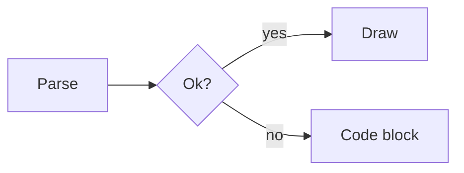

+++
title = "Markdown"
weight = 13
[extra]
group = "Reference"
+++

# Markdown

Maki renders model replies as markdown: headings, emphasis, lists, tables,
code blocks with syntax highlighting, maths, and mermaid flowcharts.

## Maths

Models write maths as LaTeX. Maki recognises four delimiters:

| Delimiter | Kind |
| --- | --- |
| `$x^2$` | inline |
| `\(x^2\)` | inline |
| `$$ ... $$` | display |
| `\[ ... \]` | display |

Terminals cannot typeset maths, so Maki approximates it with Unicode on a
single line.

| LaTeX | Renders as |
| --- | --- |
| `\frac{a}{b}` | `a/b` |
| `\sqrt{x+1}` | `√(x+1)` |
| `\sum_{i=1}^{n} i^2` | `∑ᵢ₌₁ⁿ i²` |
| `\int_0^\infty e^{-x^2} dx` | `∫₀^∞ e^(-x²) dx` |
| `\hat{x}`, `\vec{v}`, `\overline{AB}` | `x̂`, `v⃗`, `A̅B̅` |
| `\binom{n}{k}` | `C(n, k)` |
| `\begin{pmatrix} a & b \\ c & d \end{pmatrix}` | `( a b ; c d )` |
| `a \equiv b \pmod{n}` | `a ≡ b (mod n)` |

Greek letters, blackboard bold, script letters, operators, arrows, accents,
and super- and subscripts map to their Unicode equivalents. Font commands
such as `\mathbf` and `\boldsymbol` pass their content through, since a
terminal cannot restyle text inside an equation.

Where no Unicode equivalent exists, Maki falls back to readable ASCII rather
than dropping the term. A subscript of `x \to \infty` has no subscript glyphs,
so it renders as `lim_(x → ∞)`. A single symbol needs no grouping, so
`x^\infty` gives `x^∞`, while `x^{AB}` keeps its parentheses as `x^(AB)`.
Unknown commands render as their bare name, which is what makes `\sin`,
`\log`, and `\det` come out right without listing every function.

Parentheses appear only where flattening to one line would otherwise change
the reading. A fraction gets them because `\frac{a+b}{c}` collapses to a
linear `/`, so it renders as `(a+b)/c`. An integral does not, because `dx`
already ends the integrand: `\int_0^1 x^2 dx + 5` renders as `∫₀¹ x² dx + 5`.

Set `ui.math = "raw"` to see the LaTeX source instead of the approximation.
This helps when your font lacks the mathematical block.

```toml
[ui]
math = "raw"
```

### When a dollar sign is money

`It costs $5 and $10 total` stays plain text. Maki treats `$...$` as maths
only when the content does not start with a digit, or when it contains a
LaTeX signal such as `\`, `^`, `_`, or `{`. So `$2^n$` is maths and `$5 and $`
is not.

A delimiter with no closing partner stays plain text. Half-streamed equations
therefore read as source until the closing delimiter arrives, rather than
reflowing the text around them.

Maths inside a code block is code, and a code fence inside display maths is
maths. Whichever opens first wins.

## Diagrams

A ```` ```mermaid ```` block holding a flowchart is laid out and drawn with
box-drawing characters. Nothing is downloaded and no browser is involved, so
diagrams appear at the same speed as the rest of the reply.

````

````

```
                     yes ┌──────┐
                    ┌───▶│ Draw │
┌───────┐  ╭───────╮│ no └──────┘
│ Parse ├─▶‹  Ok?  ›┴┐
└───────┘  ╰───────╯ │
                     │   ┌────────────┐
                     └──▶│ Code block │
                         └────────────┘
```

Only `flowchart` and `graph` are drawn. Both keywords accept `TD`, `TB`,
`BT`, `LR`, and `RL`.

| Syntax | Support |
| --- | --- |
| `A --> B`, `A --- B`, `A -.-> B`, `A ==> B` | arrows, open links, dotted, thick |
| `A -->\|text\| B`, `A -- text --> B` | edge labels |
| `A --> B --> C`, `A & B --> C & D` | chains and fan-out |
| `[]`, `()`, `([])`, `[[]]`, `[()]`, `(())`, `{}`, `{{}}`, `>]` | node shapes |
| `subgraph Name ... end` | one level, drawn as a dashed frame |
| `<br/>` in a label | line break |
| `%%`, `style`, `classDef`, `class`, `click`, `linkStyle` | accepted and skipped |

A terminal cell cannot carry nine distinct outlines, so shapes collapse onto
four frames: square corners, round corners, a doubled edge for subroutines,
and `‹ ›` caps for decisions. Decisions are capped rather than drawn as a
diamond because a diagonal glyph meets the corner of its cell while `─` runs
through the middle, so the two never join.

Anything outside that table leaves the block as a highlighted code fence.
Sequence diagrams, class diagrams, pie charts, nested subgraphs, and self
loops all fall back this way. A half-drawn diagram would be worse than the
source, so Maki draws only what it fully understands, and it waits for the
closing fence before laying anything out.

Wide diagrams clip at the edges and mark each cut with `‹` or `›`. Hover one
and scroll sideways, or press `Shift+Left` and `Shift+Right`, to pan it in
place. Panning never changes a diagram's height, so the transcript around it
stays put. The keys move whichever diagram shows the most rows on screen,
preferring the later message when two are equal.

Set `ui.mermaid = "off"` to leave every mermaid block as code.

```toml
[ui]
mermaid = "off"
```

## Copying

Selecting text and pressing `Alt+C` copies the markdown source, not the
glyphs on screen. A copied table has its pipes, a heading has its `#`, and an
equation has its `$` delimiters and LaTeX. Pasting into a file or a chat gives
back what the model wrote.

Rendering is lossy in both directions, so some constructs copy whole. Select
part of an equation, a table row, or a list marker and you get the entire
construct, because half of `\frac{a}{b}` is not valid LaTeX. Touching any cell
of a drawn diagram copies the whole fenced block, fence lines included, since
no part of the artwork maps back to a slice of the source. Emphasis, headings,
and inline code copy at character precision.

The role prefix is part of the interface and never reaches the clipboard.
