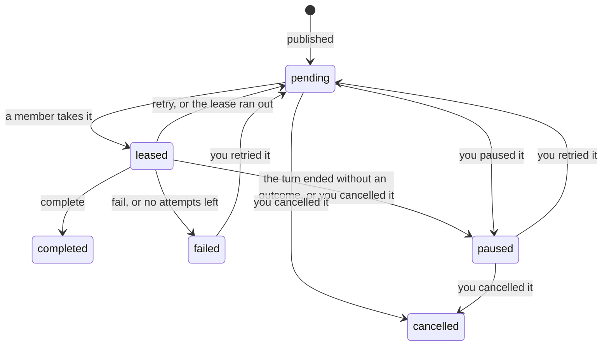

+++
title = "Cross-Session Messaging"
weight = 39
[extra]
group = "Guides"
+++

# Cross-session messaging

The experimental messaging MVP lets live main sessions on the same Unix host exchange text, including sessions in separate terminals or TUI tabs. It supports the TUI and an active one-shot `--print` run, and scripts can send with [`caudra message`](#messages-from-scripts). Subagents, the SDK, ACP, remote Workcell sessions, and managed sandbox sessions are outside this scope.

Messaging is off by default. Enable it in the **global** `caudra.toml` and restart each participating Caudra process:

```toml
[experimental]
cross_session_messaging = true

[agent.messaging]
inbound = "auto"
```

A project cannot enable the experiment. An inbound setting or saved session cannot enable it either. With the switch off, Caudra creates no messaging endpoint and exposes no messaging tools or peer-triggered wakes. Messages already in a conversation stay readable in its transcript.

## Find peers and review messages

`/peers` opens the Sessions view of the peer manager. `/messages` opens its Held messages view, and `/topics` opens its Messages view limited to topics. Switch views with `1`, `2`, and `3`. See [inbound policy and trust](/docs/permissions/#cross-session-messages) before allowing automatic delivery.

Sessions shows a discovery snapshot of eligible live peers. Select a row to inspect its messaging name, workspace, activity, inbound policy, subscriptions, and broadcast setting. `Ctrl+R` refreshes without blocking the interface. `Ctrl+B` copies the name as `@name`, or the word-based target of a peer without a name. A failed refresh keeps the previous snapshot visible with an error.

Press `/` to filter the current list, then Enter to leave filter editing. The Sessions filter also matches messaging names and subscriptions. Enter on a held message opens its review. Read the literal message body, then use `y` to approve once or `n` to review rejection. Rejecting removes the message from the live inbox. Browsing, filtering, and refreshing grant no approval. Tab switches list/detail focus. Esc backs out before closing. Narrow terminals show one pane at a time.

The Held messages view contains messages waiting for this session's review or for the session to resume. Each row names the audience the message was sent to. A message from a script shows its label marked as a script, and it has no reply target to copy. Messages browses the [message history](#browse-the-message-history). Received messages and send receipts also stay in the transcript. Use the agent to send messages.

| Command | Action |
|---|---|
| `/peers` | Open the Sessions view |
| `/messages` | Open the Held messages view |
| `/messages approve <id>` | Approve a message from the current review |
| `/messages reject <id>` | Reject a message from the current review |
| `/messages inbound auto\|accept\|hold\|refuse` | Set the session policy within project restrictions |

Open the individual message's review before using an approve or reject command. Review again if the session's mode, workspace, or policy changes. An old review cannot approve a message under new controls.

Press `p` outside filter editing to open This session. It shows the messaging name this session answers to, inbound policy, topic subscriptions, and broadcast setting. Tab and Shift+Tab move between its controls. Select a policy and press `a` to apply it. Relaxing the policy requires confirmation because it can release held messages and start billable turns. Project restrictions remain in force. Enter on a subscribed pattern removes it, and Enter on broadcasts switches them on or off. To subscribe, type one or more patterns in the field and press Enter. An invalid pattern stays in the field with the reason. The name is read-only, and the panel never changes another session's settings.

You can also ask the agent to find a session and send it a message. It uses `list_sessions` for discovery and `send_message` for delivery. It reaches many sessions at once through [topics and broadcasts](#topics-and-broadcasts), and reads earlier topic messages from the [message history](#message-history). Discovery cards show session labels, [messaging names](#messaging-names), subscriptions, workspaces, and availability, without transcript previews. A title is not a unique address.

Agents address a session by the messaging name that discovery and incoming messages show. A peer without a name, such as a session from an older Caudra build, gets a word-based target instead. That target belongs to your current live registration and is never reassigned to a replacement peer, so discover again after restarting or replacing your session. Message names also use generated words, including the names shown by `/messages` for approval or rejection.

A live session remembers up to 4,096 word-based targets and 3,072 message names. Beyond that, it forgets the least recently used ones, except those cited by messages still in its inbox. A forgotten target or message name is refused as unknown and is never given to another session or message. Discover the session again, or send without replying to the old message.

Accepted messages enter at a safe run boundary. They can also wake an eligible idle TUI session and start a billable model turn. They do not interrupt a running tool or bypass cancellation, permission review, or rate limits. The recipient still applies its own tool permissions.

Caudra presents an accepted message to the agent as a request from its sender. The agent is asked to answer it, or to do the work it asks for within its own mode and permissions, unless that conflicts with your instructions. It replies to a session with `send_message`. A script cannot receive replies, so the agent answers a script's message in its own response. Topic and broadcast messages get a reply only when the sender asks for one, and the agent is told to skip replies that only acknowledge or thank. The transcript shows each received message as a card with its sender, audience, and message name above the literal text. See [inbound policy and trust](/docs/permissions/#cross-session-messages) for what a message cannot do.

Opening or closing the manager does not resume cancelled work. While the manager is open, in any view, an idle session starts no peer-triggered turn. It starts one after the manager closes. Work already running keeps its existing safe-boundary delivery behavior.

## Messaging names

Every live session has a unique messaging name. Caudra generates it from three words, such as `@calm-proud-otter`, in the same style as plan names. A three-word name costs an agent fewer tokens to read and write than a word-based target. The name comes from the session id, so a resumed session answers to the same name without saving it.

Start a TUI session with `--name` to choose its name:

```sh
caudra --name ci-watcher
```

A chosen name suits a fixed role. Scripts and other agents keep reaching `@ci-watcher` after you replace the session with a new one that uses the same name. A name has 1 to 32 lowercase letters, digits, and hyphens, and starts with a letter or digit. Only one live session can hold a name at a time. Startup fails while another live session holds the name you chose, and the error identifies that session when discovery can find it. A new session also takes the chosen name as its title.

Agents address a session as `@ci-watcher` in `send_message`, and scripts use `caudra message send --to ci-watcher`. Each send looks the name up again, so the message reaches whichever live session holds the name at that moment.

The session saves a chosen name and claims it again when you resume it, even if it has received nothing yet. If another live session holds the name by then, the resumed session answers to its generated name and shows a warning. This session in the peer manager lists both names. The session tries the chosen name again the next time you resume it. A session open twice at once answers to a second generated name in its second copy. `/rename` changes only the title, so renaming a session never changes its name. Forks and new sessions get a generated name of their own.

## Topics and broadcasts

A topic message reaches every live session that subscribes to the topic. A broadcast reaches every live session that opted in to broadcasts. Long-running agents use them to coordinate, for example when a CI watcher tells the agents working on a repository that a build failed.

A topic is a dot-separated name such as `ci.failures`. It has 1 to 8 segments within 128 bytes. A segment uses lowercase letters, digits, hyphens, and underscores, and starts with a letter or digit. A subscription is a pattern where `*` matches exactly one segment and a final `**` matches one or more. `ci.*` matches `ci.failures` but not `ci.failures.linux`, and `ci.**` matches both. A session holds at most 16 patterns.

Subscribe when you start a TUI session:

```sh
caudra --name ci-watcher --topic 'ci.**' --receive-broadcasts
```

`--topic` is repeatable. It adds to the patterns a resumed session already has and never removes one. `--receive-broadcasts` opts the session in to broadcasts. Change subscriptions later in the peer manager's This session panel, from its Messages view, or with `/topics`:

| Command | Action |
|---|---|
| `/topics` | Open the Messages view limited to topics |
| `/topics subscribe <pattern>...` | Add one or more patterns |
| `/topics unsubscribe <pattern>...` | Remove one or more patterns |
| `/topics broadcast on\|off` | Opt in to broadcasts or out of them |

Only you control subscriptions, and agents have no tool to change them. The session saves them with its other messaging controls and restores them when you resume it. A subscription is saved right away, even in a session with no messages yet. Forks and new sessions start without any. Other sessions see a change the next time they discover peers.

Agents publish with `publish_message`, giving either a concrete `topic` or `broadcast: true`. Wildcards belong only in subscriptions. A session that has not opted in to broadcasts never receives one, so a broadcast cannot wake it.

The publisher discovers live sessions once and keeps the matching ones as the fixed recipient set. It sends to at most `max_fanout` of them and reports the rest as skipped. Each recipient checks its own subscriptions again on arrival and refuses the message as not subscribed when they no longer match. The receipt lists every recipient with its own status. A retry under the same identity sends again only to recipients whose status is `unknown`.

The recipient sees the audience in the message provenance. A reply goes to the publisher alone through `send_message`, as a direct message between the two sessions. Published messages pass the same inbound policy, permission review, and rate limits as direct messages.

## Messages from scripts

`caudra message` sends and reads messages from a shell, so a CI job or a git hook can tell your agents about an event:

```sh
caudra message publish --topic ci.failures --from nightly-ci "Build 1042 failed on linux"
make test 2>&1 | tail -n 50 | caudra message send --to ci-watcher
caudra message log --topic 'ci.**' -n 5
```

The command needs the same global experiment switch and runs on Linux and macOS. It reaches the live sessions of your user on this machine and opens no endpoint of its own. A script can send, but nothing can reply to it. [`caudra message`](/docs/cli/#caudra-message) lists every option and exit code.

The `--from` label names the sender, `script` by default. Recipients see the message as coming from a script rather than a session, and the label tells scripts apart. A script has no messaging name, mode, or reply target. [Rate limits and duplicate checks](#rate-limits-and-cost) count each label as one sender across runs.

The [message history](#message-history) records script messages like any other. A topic message that no live session receives still serves catch-up, so a session that subscribes later catches up on the newest one.

The `auto` inbound policy never delivers a script message automatically, because its trust check compares two sessions and a script is not one. It holds the message for review, and `read_topic` counts script messages as withheld. A session that should wake on script events needs `accept`, set with `/messages inbound accept` or in `[agent.messaging]`. See [inbound policy and trust](/docs/permissions/#cross-session-messages).

## Consumer groups

A topic message reaches every subscriber. A consumer group instead turns each message on its topics into one work item, hands the item to a single member, and tracks it until that member's agent reports an outcome. Use a group when several agents share a queue of jobs, such as one fix per failed build.

Create the group with [`caudra message group`](/docs/cli/#consumer-groups-from-the-shell), then start the sessions that should take its work with `--group`:

```sh
caudra message group create build-fixes --topic ci.failures --concurrency 2
caudra --name fixer-1 --group build-fixes
caudra message publish --topic ci.failures --from nightly-ci "Build 1042 failed on linux"
```

A member takes work from a script publication like this one only under the `accept` inbound policy, which `/messages inbound accept` sets. See [Messages from scripts](#messages-from-scripts). Joining with `--group` or `/groups join` warns when the session's policy skips some work, and `/groups` counts the queued items it skips in each group.

Every member shares the group's policy. It names the topic patterns, how many items members work on at once, how many attempts an item gets, and how many unfinished items the group holds. Members cannot change it, and agents have no tool to create, join, or change a group. Groups and their work belong to your user on this machine, so every project sees the same ones.

A group queues work only for messages published after its creation. A matching publication becomes one item per group, even when several of the group's patterns match it. The group keeps its queue while no member is live, and pausing the group keeps the queue while handing out nothing. The publish receipt lists the queued items apart from the live recipients. A queued item still waits for a member to take it and report an outcome.



### How a member works on an item

A live TUI member looks for work while it idles and holds one item at a time across all its groups. It takes only an item whose message its [inbound policy](/docs/permissions/#cross-session-messages) would deliver automatically, so under `auto` it leaves script publications to members with `accept`. A member never takes an item from its own publication, and a ReadOnly session takes none because its agent cannot report an outcome. The item starts a turn of its own as a work assignment that names the group, the work item, and the attempt. A `--print` run never takes work.

The member holds a 120-second lease on the item and renews it every 20 seconds while its turn runs, including waits for the model, a tool, or your permission review. The agent reports the outcome with the `work_assignment` tool:

| Action | Result |
|---|---|
| `complete` | The item is done, with an optional summary |
| `retry` | The attempt failed, and another attempt may succeed. The item returns to the queue after 5 seconds, then 30, until its attempts run out |
| `fail` | The item failed for good |
| `list` | Shows the item this session works on and the items it paused |

A reply to the publisher, a finished turn, or a delivered message never completes an item. A turn that ends without an outcome pauses the item with `completion required`, so the item waits for you rather than going to another member. When you press Esc during the turn, Caudra records the pause before the cancellation reaches the turn. Cancelling a run, or a run that ends in an error, also stops the session from taking work until your next local input, as it stops [automatic wakes](#rate-limits-and-cost). A paused item stays paused until you retry or cancel it. Until then, the agent that paused it can still report its outcome, for example after you ask it to finish.

When a member stops renewing its lease, for example because its process crashed, the item returns to the queue once the lease runs out and that attempt counts. Every attempt gets a fresh lease. A member whose lease ran out can no longer report on the item. Caudra stops its turn, and as after any cancelled run, that session takes no work until your next local input. An item therefore runs at least once and sometimes more than once, because an expired attempt may have had effects before another member repeats it. Keep group work safe to repeat, or check its effects before you retry it.

### Join and manage groups

`--group` is repeatable. It adds to the groups a resumed session already belongs to, and startup fails when a group does not exist. A session belongs to at most 8 groups and saves its memberships with its other messaging controls. `/groups` changes them later and manages work:

| Command | Action |
|---|---|
| `/groups` | List the groups, mark the ones this session belongs to, count the queued work its inbound policy skips in each, and show the work it holds |
| `/groups join <group>` | Take work from an existing group |
| `/groups leave <group>` | Stop taking new work from a group. The item the session holds stays its own |
| `/groups retry <work>` | Queue a paused, failed, or cancelled item again with a full set of attempts |
| `/groups pause <work>` | Hold a queued item until you retry it |
| `/groups cancel <work>` | Give up on a queued, paused, or failed item |

Retrying an item can repeat effects of its earlier attempts, so `/groups retry` warns when the item already ran. Membership is separate from subscriptions. A session that subscribes to a topic and also belongs to a group on it receives each message twice, once as a notification and once as work.

Each group counts as one of a publication's `max_fanout` destinations. A group holds at most 1,000 unfinished items, and all groups together hold at most 10,000. A publication that would exceed either limit fails before any session receives it. Pruning never removes the message of an unfinished item.

## Delivery receipts and lifetime

| Status | Meaning |
|---|---|
| `queued` | Accepted into the live inbox, not yet delivered to the model |
| `held` | Accepted into the live inbox, waiting for approval or for the receiving session to resume |
| `refused`, `unavailable`, `rate_limited` | Not admitted |
| `unknown` | Delivery may have been accepted before the connection failed |

A receipt does not promise a reply or completed work. Do not treat `unknown` as a definite failure and send the same request again under a new identity.

Queued and held messages live only in bounded memory. Closing or replacing the receiving session, exiting, or crashing can discard them. There is no offline inbox or crash-durable delivery guarantee. Messages already recorded in conversation history follow normal session retention. Reloading or rewinding history never sends them again. The [message history](#message-history) keeps a record of every message, and only topic messages return from it, through catch-up.

Each body is limited to 32 KiB of UTF-8. The inbox admits at most 50 messages across pending, held, and claimed states, with a 1 MiB session ceiling and an 8 MiB process ceiling. A full inbox rejects new messages rather than evicting older ones.

## Message history

Every message a session or script sends is recorded in a message history that all sessions of your user share. This covers direct messages, topic messages, and broadcasts. An entry keeps the sender, the audience, the text, and each recipient's outcome as it moves from queued or held to delivered, rejected, or dropped. The history uses tables in the canonical SQLite file `caudra.db` in the [state directory](/docs/configuration/#directory-layout), and only your user can read it. Recording happens before sending. When the history cannot record a message, the send fails and no recipient gets it.

The history is a record rather than an inbox, so a message still needs a live recipient when it is sent. Sessions use the history in two ways.

Catch-up brings a session up to date on its topics. When a session registers, changes its subscriptions, or starts a turn, it collects the newest message it has not seen on each topic it subscribes to, at most 16 messages. They join the next turn without starting one. A message counts as seen once the conversation takes it in or you reject it. Caught-up messages pass the same inbound policy as live ones, so a message the policy holds waits in Held messages.

Agents read the history with `read_topic`. Without arguments it lists stored topics with their message counts and latest activity. With a topic or subscription pattern, or with `broadcast: true`, it returns up to 50 messages per page, newest first. While older messages remain, the page also returns a `before` value that reads them. Reading wakes no session and leaves catch-up unchanged. Direct messages stay out of its results. The session's inbound policy decides what its agent may read:

| Inbound policy | `read_topic` returns |
|---|---|
| `accept` | Every stored message |
| `auto` | Messages from senders the session would accept automatically. The rest are counted as withheld, without their text |
| `hold`, `refuse` | An error |

Caudra removes messages older than `history_days`, except the newest message on each topic, and then the oldest messages beyond `history_max_messages`. Pruning runs when a process opens the history, and at most once an hour while that process uses it. Every project shares one history, so only the global `caudra.toml` can set these limits:

```toml
[agent.messaging]
history_days = 30
history_max_messages = 50000
```

A project file that sets either key fails to load.

## Browse the message history

The Messages view of the peer manager lists every stored topic, the broadcasts, and this session's direct conversations, most recently active first. Each row shows its message count and latest activity, and marks a topic this session receives by exact subscription or through a wildcard pattern. `/topics` opens the view limited to topics, and `3` shows every channel again.

Enter reads the selected channel, with the newest message at the bottom. Each message shows its sender, time, and audience, with every recipient's outcome below it. A script sender is marked as a script, and a recipient shows the messaging name it held. While the reader shows the newest message, it follows new ones as they arrive. `o` loads older messages above the ones on screen. `Ctrl+R` reloads the list and the open channel.

`s` subscribes this session to the selected topic or unsubscribes it, and on Broadcast it switches broadcasts on or off. A topic that this session receives only through a wildcard pattern needs the [This session](#find-peers-and-review-messages) panel to change that pattern.

The view shows every stored message whatever the inbound policy, because only you read it there. It checks the history for changes once a second while it is on screen. Browsing approves nothing and leaves catch-up unchanged. Session ids never appear, so a direct conversation shows the other session's messaging name or title.

## Rate limits and cost

Rate limits are the only volume control. A receiving session admits at most 64 messages per minute in total and 16 per minute from any one sender. A message over either limit gets `rate_limited` and never enters the inbox. A session publishes at most 16 topic or broadcast messages per minute. A publication over that rate is refused before anything is sent, and a retry of an earlier publication does not count. Each publication reaches at most 32 recipients. All windows are rolling. Set the limits in the global `caudra.toml`:

```toml
[agent.messaging]
inbound_per_minute = 64
sender_per_minute = 16
publish_per_minute = 16
max_fanout = 32
```

A project file can lower these limits but cannot raise them.

The same text from the same sender within one minute gets `refused` as a duplicate. A retry of one message under its original identity is not a duplicate and returns the first receipt.

The per-sender limit and the duplicate check follow the sending session rather than its process, so a restarted or resumed session keeps its counts. Each `--from` label of a script counts as one sender across runs.

Two sessions that deliver to each other automatically can keep a conversation going without you. Each accepted message can start a billable model turn. The limits slow such a pair to `sender_per_minute` turns per minute each, and the exchange continues until one side stops. Press Esc in either session to stop it. Cancelling a run, or a run that ends in an error, stops automatic wakes for that session until your next local input. Messages that arrive meanwhile are held. A resumed session keeps this state.
